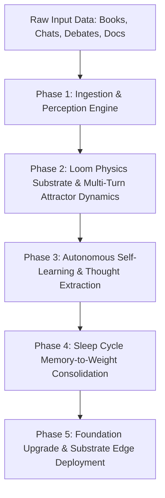

# DocLoom Master Architecture & Pipeline Plan

## Executive Vision & Paradigm
DocLoom reverses the standard AI paradigm. Instead of building bloated multi-billion parameter models (7B, 70B, 405B) that attempt to store all world facts inside static weights, DocLoom pairs a **small, high-speed neural decoder (50M–80M parameters)** with a **living, dynamic physics memory substrate (Loom)**.

World knowledge, conversational context, and dynamic facts remain in the memory substrate; the small neural decoder learns how to attend to memory, think through evidence citations, and express crisp, fluent decisions.

---

## The Complete End-to-End System Pipeline



---

## Detailed Phase Breakdown

### Phase 1: Ingestion & Perception Engine (Hippocampal Input Layer)
* **Multi-Modal Data Readers**:
  * Ingests WhatsApp export text, technical PDF/Markdown books, debate transcripts, and live user interactions.
* **Physics State Initializer**:
  * Every ingested text shard is assigned a 384d MiniLM embedding vector and initialized with physics dynamics:
    * **Activation ($A$)**: Initialized based on recency & source authority ($0.8 - 1.0$).
    * **Energy ($E$)**: Kinetic memory potential.
    * **Phase Angle ($\theta$)**: Kuramoto oscillator phase angle for associative wave synchronization.
    * **Stability ($S$) & Resonance ($R$)**: Decay resistance and graph connectivity.
* **Spatial & Causal Graph Wiring**:
  * Connects adjacent shards via co-occurrence edges (`working_set_pairs`) without requiring hardcoded schema tables.

### Phase 2: Live Memory Substrate & Multi-Turn Attractor Dynamics
* **Stepwise Exponential Decay**:
  $$A_t = A_{t-1} \cdot e^{-0.25}$$
  Fades inactive shards naturally per turn ($A < 0.10$ pruned).
* **Attractor Blending & Basin Escape**:
  * Computes cosine similarity $\text{sim} = \mathbf{v}_{\text{query}} \cdot \mathbf{v}_{\text{attractor}}$.
  * **Coreference ($\text{sim} \ge 0.30$)**: Blends query with attractor ($\mathbf{v} \leftarrow 0.60\mathbf{v}_{\text{query}} + 0.40\mathbf{v}_{\text{attractor}}$) with a $1.6\times$ focal priority multiplier on active shards.
  * **Topic Shift ($\text{sim} < 0.30$)**: Releases prior attractor, resets focus to the new query, and clears stale working-memory multipliers.
* **Memory Projection & Cross-Attention Bridge**:
  * `MemoryProjection` converts physics features + content embeddings into 8 latent `Memory Tokens`.
  * `MemoryCrossAttention` injects memory tokens directly into the backbone attention blocks.

### Phase 3: Autonomous Self-Learning & Thought Extraction (The Synthesis Engine)
* **Continuous Memory Monitor (`auto_synthesize.py`)**:
  * Periodically scans newly ingested `.brain_data` memory clusters and live conversation logs.
* **Zero-External-API Thought Synthesis**:
  * Algorithmic extraction using rule-based syntactic parsing, contrastive entity extraction, and memory graph traversal to build `{Context Shard, Intent Query, Evidence Citation, Crisp Answer}` triples.
* **Standardized Thought Formatting**:
  ```text
  <|user|>
  {Question}
  <|assistant|>
  <|think|>
  Evidence: "{Exact Evidence Quote}"
  </|think|>
  <|answer|>
  {Direct Fact}
  <|end|>
  ```

### Phase 4: Sleep Cycle Memory-to-Weight Consolidation (Neocortical Transfer)
* **Idle System Monitor**:
  * Automatically detects system idle state (low CPU/GPU usage, zero active queries).
* **Background Weight Consolidation**:
  * Drains synthesized thought triples from the memory buffer.
  * Runs short, high-efficiency training passes on LoRA adapters (`qa`), `MemoryCrossAttention`, and `MemoryProjection`.
  * **100% Frozen Backbone Safety**: Base model weights, embeddings, and main LayerNorms remain frozen, preventing catastrophic forgetting of foundational English.
* **Live Checkpoint Hot-Swapping**:
  * Saves updated `docloom_stageB.safetensors` and hot-swaps weights into the live coordinator without stopping the system.

### Phase 5: Language Decoder Foundation & Edge Chip Deployment
* **Backbone Scaling (50M–80M Parameters)**:
  * Scale base decoder from 20M to 50M–80M parameters (6–8 layers, 512 embedding dim, 8 attention heads).
  * Pretrain Stage A on a clean open-source adult English corpus (MiniPile / FineWeb-Edu subset) so the base model possesses rich vocabulary and fluent grammar.
* **Edge System-on-Chip (SoC) Export**:
  * Quantize model weights to INT8 / INT4 ONNX and GGML format.
  * Target footprint: $< 150\text{ MB RAM}$, sub-10ms response latency, 100% offline edge execution.

---

## Execution Roadmap

| Milestone | Phase | Key Deliverables | Status |
| :--- | :---: | :--- | :---: |
| **M1: Core Substrate & Physics** | Phase 1 & 2 | Physics ledger, `recall_multi_pass`, Attractor Dynamics ($\text{sim} \ge 0.30$), Cross-Attention bridge | **COMPLETE** |
| **M2: Thinking Layer & Direct QA** | Phase 2 & 3 | `<|think|>` evidence citations, `<|answer|>` direct facts, zero-apology dataset generator | **COMPLETE** |
| **M3: Autonomous Memory Ingest Loop** | Phase 3 | `auto_synthesize.py` scanner converting arbitrary text (books/chats) into thought triples | **NEXT IN PROGRESS** |
| **M4: Sleep Consolidation Engine** | Phase 4 | Idle system monitor + background LoRA weight updater + live checkpoint hot-swapper | **PLANNED** |
| **M5: 50M Adult Foundation Model** | Phase 5 | Stage A 50M pretraining on MiniPile for fluent adult vocabulary | **PLANNED** |
| **M6: Substrate Edge Deployment** | Phase 5 | 4-bit ONNX/GGML quantization for edge chip deployment | **PLANNED** |
